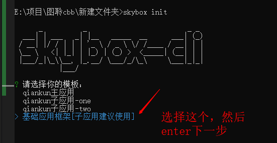

# 快速开发

## 一、通过git下载代码

#### 代码地址
仓库地址：[https://code.iflytek.com/osc/_source/Y_RDG-TURING/turing-cbb/frontend-code-tpl/turning-ui-frame/-/code/](https://code.iflytek.com/osc/_source/Y_RDG-TURING/turing-cbb/frontend-code-tpl/turning-ui-frame/-/code/)

#### 权限开通
联系人：mxliu5


## 二、通过脚手架安装

#### 环境要求
```
项目使用pnpm
node 16+
20之后未测试【建议不超过20】
```

#### 设置公司 npm 镜像仓库
如果已经是公司npm镜像，无需再设置，可通过`npm config get registry`命令查看
```
npm config set registry=https://depend.iflytek.com/artifactory/api/npm/npm-repo
```

#### 安装依赖包到全局

```
npm install skybox-cli -g
```

#### 测试安装成功

```
skybox -V
```

#### 初始化【根据提示下载，需要开通代码下载权限(baozhang4)】
```
skybox init
或
skybox i
```



#### 代码下载权限开通

联系人：baozhang4

