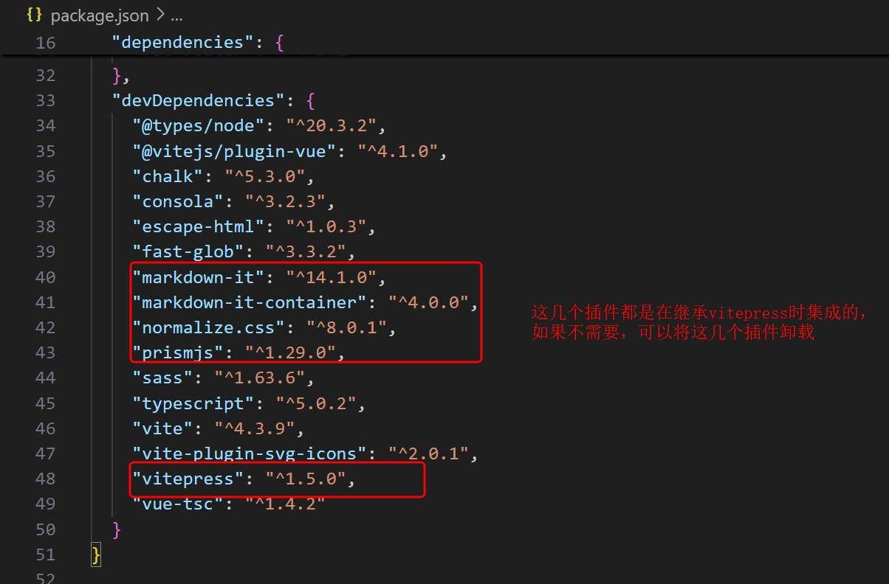
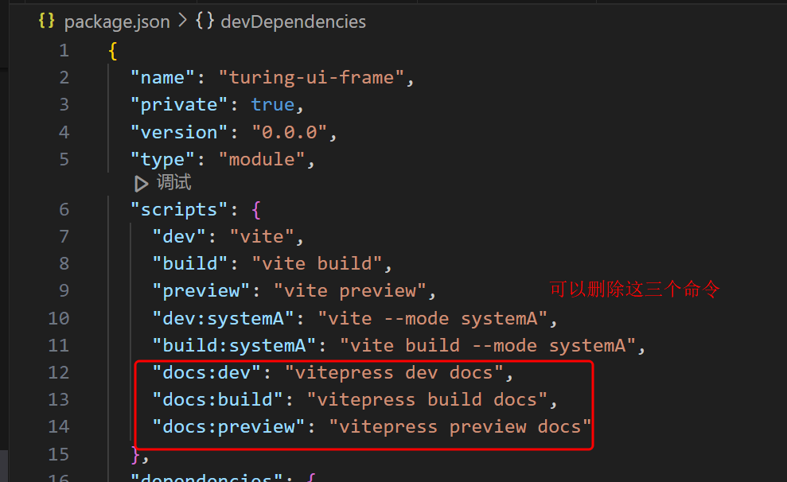

# 补充说明

## vitepress在线说明文档集成（/docs）
项目中集成了vitepress在线说明文档生成器，可以通过以下命令本地启动在线文档访问地址
```
npm run docs:dev
```

#### 保留vitepress
如果项目实现比较复杂，可以考虑保留，将实现过程中比较复杂的内容以及逻辑添加在在线说明文档上，这样有利于项目的交接以及存档。不至于一个项目时间久了不清楚之前的实现

#### 删除vitepress
如果不需要，可以按照以下步骤删除：
1. 删除/docs目录
2. 卸载如下内容：

```bash
npm uninstall vitepress markdown-it markdown-it-container normalize.css prismjs
```
3. 删除package.json中script中不需要的启动方式




这样就可以删除vitepress集成了